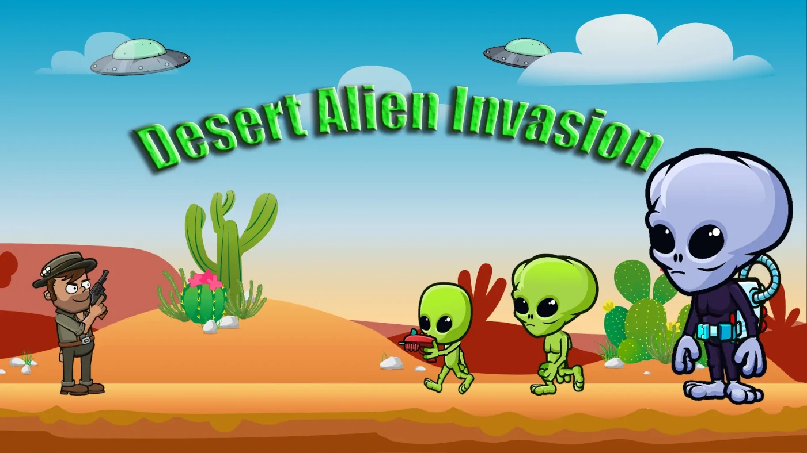

<div align="center">

# 🛸 Desert Alien Invasion

This project was developed in March 2025 as part of the training programme at the **Developer Academy Munich**, with the aim of gaining a deeper understanding of object-oriented programming and applying it in practice.

[](https://desert-alien-invasion.marcel-lukas.com/)


</div>

---

## 🎮 Preview

**Defend the world against a ruthless alien invasion! Arm yourself with a pistol and grenades and fight for survival in this action-packed browser game.**

[](https://desert-alien-invasion.marcel-lukas.com/)

---

## 🕹️ Controls

| Action | Keyboard | Mobile |
|---|---|---|
| Move left | `A` / `←` | Touch button |
| Move right | `D` / `→` | Touch button |
| Jump | `W` / `Space` / `↑` | Touch button |
| Shoot (pistol) | `R` | Touch button |
| Throw grenade | `F` | Touch button |

> The game also supports **touch controls** on mobile devices as well as a **fullscreen mode**.

---

## ✨ Features

- 🎯 **Side-scrolling action** on an HTML5 Canvas (720 × 480 px)
- 👾 **Two enemy types** – Green Alien & Brain Alien – each with unique animations and AI
- 💀 **End boss** with 2,000 health points, a dash attack, and an alert sequence
- 🔫 **Two weapon systems** – Pistol (single shot) & Grenades (area-of-effect explosion)
- ❤️ **Collectibles** – Pistol ammo, grenades, and health packs scattered across the map
- 🌅 **Parallax background** with three independent layers plus clouds
- 📱 **Responsive & mobile-friendly** – automatic landscape hints + touch controls
- 🔊 **Full sound design** with a toggle mute button
- 🖥️ **Fullscreen support**
- 🏆 **Win & Game Over screen** with instant restart

---

## 🏗️ Technical Architecture

The project uses exclusively **Vanilla JavaScript**, **HTML5 Canvas**, and **CSS** – no external frameworks or libraries.

### Class Hierarchy (OOP)

```
DrawableObject
└── MovableObject
    ├── Character          – Player character
    ├── GreenAlien         – Standard enemy
    ├── BrainAlien         – Enemy with ranged attack
    ├── Endboss            – Final boss with dash attack
    ├── ThrowableObject    – Thrown grenade
    ├── ShootableObject    – Fired projectile
    ├── Explosion          – Grenade explosion
    ├── Health             – Health pack collectible
    ├── GrenadeAmmunition  – Grenade collectible
    └── PistolAmmunition   – Pistol ammo collectible

World                      – Game world & game loop
Level                      – Level setup & objects
Keyboard                   – Keyboard input handler
StatusBar                  – Player health bar
BossStatusBar              – End boss health bar
CollectedGrenades          – Grenade HUD
CollectedPistolAmmunition  – Ammo HUD
```

### Project Structure

```
📁 2D Game
├── index.html          – Entry point, UI & overlays
├── style.css           – Main styles
├── responsiv.css       – Mobile & responsive styles
├── fonts.css           – Custom fonts
├── 📁 js/
│   ├── game.js         – Game logic, start/restart, fullscreen
│   └── sounds.js       – Sound objects & mute logic
├── 📁 models/          – All game classes (OOP)
├── 📁 levels/
│   └── level1.js       – Level config (enemies, items, backgrounds)
├── 📁 img/             – Sprites, backgrounds, UI icons
└── 📁 audio/           – Sound effects & background music
```
